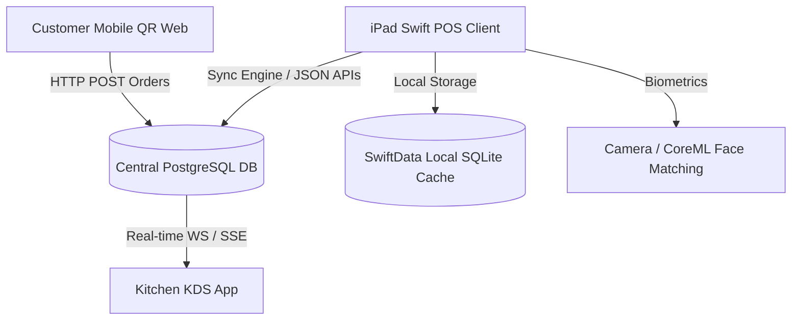

# AlphaPos Database & System Integration Guide

Welcome to the AlphaPos codebase. This folder contains the core database architecture designs, Swift structures, and SQL scripts required to build the POS system.

---

## Folder Contents

1. **[Models.swift](file:///Users/mac/Documents/AlphaPos/Models.swift)**: Modern `SwiftData` models for Swift client applications (iPad/macOS POS app).
2. **[schema.sql](file:///Users/mac/Documents/AlphaPos/schema.sql)**: Complete relational schema for the central cloud server (PostgreSQL).
3. **[triggers.sql](file:///Users/mac/Documents/AlphaPos/triggers.sql)**: Automated inventory stock deduction triggers triggered by order status updates (Base Menu Item + Menu Modifiers).
4. **[procedures.sql](file:///Users/mac/Documents/AlphaPos/procedures.sql)**: Payroll computation engines, timecard audit controls, and Thai Social Security Fund (SSF) deduction calculation procedures.

---

## Database Architecture Overview

The system is designed with a **hybrid client-server architecture** supporting **Offline-First operation**, **dynamic QR ordering**, and **biometric employee verification**:



---

## System Workflows & Design Specifications

### 1. Offline-First Sync Engine
Every model in [Models.swift](file:///Users/mac/Documents/AlphaPos/Models.swift) and table in [schema.sql](file:///Users/mac/Documents/AlphaPos/schema.sql) contains metadata columns:
* `isSynced` / `is_synced` (`Bool` / `BOOLEAN`): Set to `false` when mutated locally on the iPad.
* `isDeleted` / `is_deleted` (`Bool` / `BOOLEAN`): Used for **soft deletions** so sync changes can propagate.
* `updatedAt` / `updated_at` (`Date` / `TIMESTAMP`): Used to determine conflict resolution (Last-Write-Wins).

#### Replication Sync Flow:
1. **Local Writes**: iPad POS writes directly to local SQLite via `SwiftData`. If offline, mutations queue up with `isSynced = false`.
2. **Push Queue**: The client polls for records where `isSynced == false` and posts them to the server via JSON endpoints.
3. **Pull updates**: Client queries the server for `updated_at > last_sync_timestamp` to pull remote changes.
4. **Deletes**: When an entity is deleted in SwiftData, set `isDeleted = true`. During the next sync, the server flags the row as `is_deleted = TRUE` (and vice-versa), before purging locally.

---

### 2. Direct-to-Kitchen QR Ordering
To bypass manual cashier confirmation and avoid bottleneck delay:
1. **Scan**: Customer scans dynamic table-specific QR URL containing a transient `session_token`.
2. **Order**: Order details are submitted to the backend API.
3. **Insert**: PostgreSQL creates the order with `status = 'preparing'` and order items with `status = 'cooking'`.
4. **Broadcast**: A PostgreSQL trigger/event or a server webhook pushes a notification via WebSockets directly to the **Kitchen Display System (KDS)** and iPad POS.
5. **Auto-Deduct Stock**: A trigger (`trg_deduct_stock_on_order_item`) in [triggers.sql](file:///Users/mac/Documents/AlphaPos/triggers.sql) executes, resolving item recipes and selected modifier ingredients, and deducting them from `inventory_items.current_quantity`.

---

### 3. Face-Scan Clock-In Validation
The employee register system provides automatic fraud prevention (buddy-punching) by scanning the employee's face at clock-in/out:

#### Setup & Enrollment:
1. The employee profile is registered on the iPad POS.
2. The front camera captures the face, processes it locally using Apple's **Vision Framework**, and extracts a **512-dimension face embedding vector**.
3. This vector is serialized as binary bytes into `Employee.faceEmbeddingData` and synced to the cloud `employees.face_embedding` column as JSON.

#### Daily Clock-In Check-In:
1. The employee clicks "Clock In" and faces the front camera.
2. The iPad client extracts the live face embedding vector.
3. A local Euclidean/Cosine distance comparison runs against `Employee.faceEmbeddingData`.
4. **Approval Match**:
   * If distance is below threshold (match confidence > 95%), a new [Timecard](file:///Users/mac/Documents/AlphaPos/Models.swift) is generated locally with `status = "approved"`.
   * The live selfie photo is uploaded to AWS S3/Cloud Storage, linking its URL (`clockInSelfieUrl`) inside the timecard for managers to audit.
5. **Approval Failure**:
   * If the match confidence is low, the request is flagged with `status = "pending_audit"`, requiring manager review in [procedures.sql](file:///Users/mac/Documents/AlphaPos/procedures.sql) (`audit_employee_timecard`).

---

### 4. Payroll Computation Engine
Payroll calculations run on the PostgreSQL server utilizing [procedures.sql](file:///Users/mac/Documents/AlphaPos/procedures.sql):
* **Hourly Staff**: Multiplies hours worked on approved timecards by their `pay_rate`. Breaks are deducted (break minutes / 60.0).
* **Monthly Salaried Staff**: Base salary is fixed.
* **Overtime (OT)**: Multiplies overtime hours by the employee's OT hourly rate with a multiplier (default: `1.5x`).
* **Thai Social Security Fund (SSF)**: Deducts 5% (`0.05`) of base pay, capped at `750.00 THB` per month (Thai national regulation).
* **Execution**: Run `CALL generate_payroll_for_period('2026-06-01', '2026-06-30', '2026-07-01');` to batch calculate payroll slips.

---

## Backend Deployment (PostgreSQL Setup)

To configure your cloud database, run the SQL scripts in order:

```bash
# 1. Create tables
psql -h <host> -U <user> -d alphapos_db -f schema.sql

# 2. Register stock triggers
psql -h <host> -U <user> -d alphapos_db -f triggers.sql

# 3. Import payroll stored procedures
psql -h <host> -U <user> -d alphapos_db -f procedures.sql
```

---

## How to Run on iPad Simulator in Xcode

Since this workspace contains raw Swift and SwiftUI source files, you can compile and run it on an **iPad Simulator** in Xcode in less than a minute by following these steps:

### Step 1: Create a New Xcode Project
1. Open **Xcode** and select **Create a New Xcode Project** (or `File -> New -> Project`).
2. Choose **iOS** and select the **App** template. Click **Next**.
3. Set the project details:
   - **Product Name**: `AlphaPos`
   - **Interface**: `SwiftUI`
   - **Language**: `Swift`
   - **Storage**: Select **None** or **SwiftData** (we define our model container manually in `App.swift`).
4. Choose a folder to save the project and click **Create**.

### Step 2: Drag and Drop the Source Files
1. In Xcode's Project Navigator (left sidebar), delete the default generated `ContentView.swift` and `AlphaPosApp.swift` (Move to Trash).
2. Open Finder and navigate to your workspace directory: `/Users/mac/Documents/AlphaPos/`
3. Drag the following files and folders from Finder directly into Xcode's Project Navigator:
   - **[App.swift](file:///Users/mac/Documents/AlphaPos/App.swift)**
   - **[Models.swift](file:///Users/mac/Documents/AlphaPos/Models.swift)**
   - **[Views/](file:///Users/mac/Documents/AlphaPos/Views/)** folder
4. In the dialog that pops up:
   - Check **Copy items if needed**.
   - Select **Create groups**.
   - Ensure the `AlphaPos` target is checked. Click **Finish**.

### Step 3: Run the iPad Simulator
1. In Xcode's top toolbar, click on the **Run Target** dropdown (which might say "Any iOS Device" or a specific iPhone model).
2. Scroll to the **iPad** section and select a simulator (e.g., **iPad Pro (11-inch)** or **iPad (10th generation)**).
3. Select **Landscape** orientation if desired (the UI is fully responsive but optimized for tablet widths).
4. Click the **Run** button (the Play icon) or press **`Cmd + R`**.
5. The iPad Simulator will boot up and launch your AlphaPos app! Click **"Seed Mock Data"** inside the POS or Tables system tabs to populate it instantly for testing.

