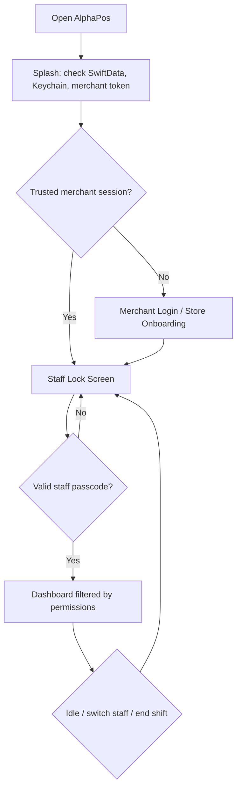

# AlphaPos Auth and Staff UX Architecture

Created: 2026-06-17

## Objective

AlphaPos is a shared POS workstation, not a single-user banking app. The correct model is three separate sessions:

1. Merchant session: the store tenant bound to Supabase RLS through merchant JWT.
2. Device session: the trusted register, tablet, or KDS device allowed to operate for that merchant.
3. Staff session: the person currently using the device, unlocked by passcode or biometrics.

The app should never treat `is_logged_in` as the only source of truth. It is now only a compatibility flag while `AppSessionManager` owns the launch route.

## Launch Flow

## UX Principles

- Splash must be short, branded, and functional. It should communicate secure startup, not feel like decoration.
- Returning devices must not ask for owner email/password every time. They show staff selection and passcode first.
- Staff selection must be fast under pressure: large targets, clear role labels, keypad optimized for touch.
- Sensitive actions must use manager override: refund, void, manual cash drawer open, high discount, security settings.
- Owner logout is different from staff lock. Staff lock keeps the store/device session alive.

## Implemented Foundation

- `AppSessionManager`: state machine for `splash`, `merchantLogin`, `staffLock`, and `dashboard`.
- `SplashScreenView`: startup view with secure-session status.
- `StaffLockView`: shared-device staff selector and passcode keypad.
- `PermissionService`: typed permission keys and default role fallback.
- `Role.permissionKeys`: comma-separated permission catalog for SwiftData/offline mode.
- Supabase migration `023_staff_permissions_and_device_sessions.sql`: role permissions, merchant devices, staff sessions, security policies.

## Permission Matrix

| Role | Default Permissions |
| --- | --- |
| Owner/Admin | All permissions |
| Store Manager | POS, refunds, voids, discounts, cash drawer, tables, kitchen, inventory, reports, payroll, staff, manager override |
| Cashier/Staff | POS sell, discounts, cash drawer open |
| Waitstaff | POS sell, table management, kitchen view |
| Kitchen Staff | Kitchen view |

Production authorization should check permission keys, not role names or email strings.

## Data Ownership

SwiftData remains the offline-first cache and local source for staff lock. Supabase remains the tenant authority. Security-sensitive events should be written to `audit_logs` or `staff_sessions` when online and queued for sync when offline.

## Next Integration Steps

1. Add Staff and Permissions settings UI for editing role permission keys.
2. Replace email-string checks with `PermissionService.can(...)`.
3. Move all PIN/passcode checks to one authentication service and remove plain PIN fallback in production.
4. Add staff session timeout and a lock button in the dashboard sidebar.
5. Sync `merchant_devices`, `staff_sessions`, `security_policies`, and `role_permissions`.
